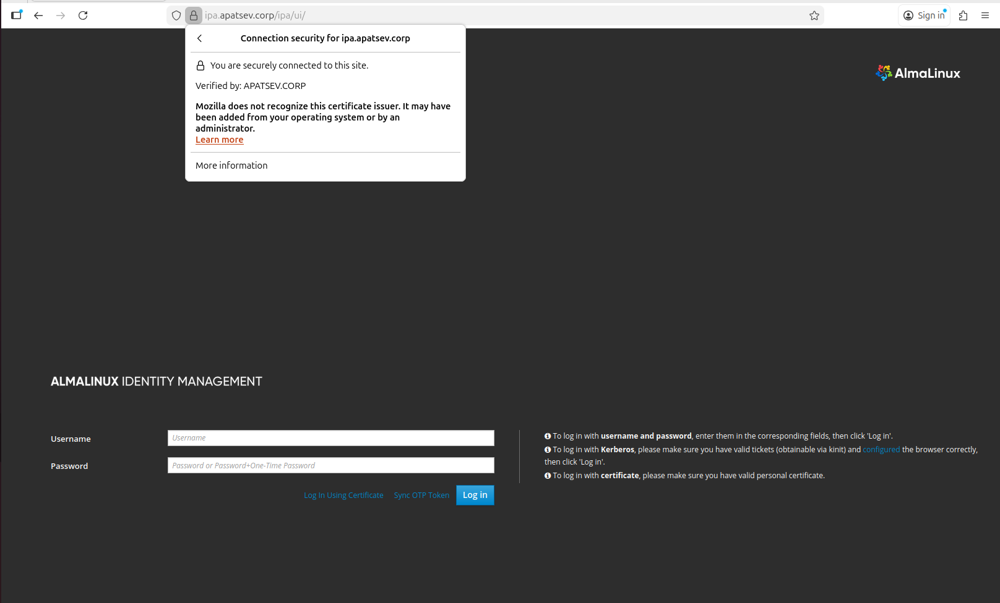
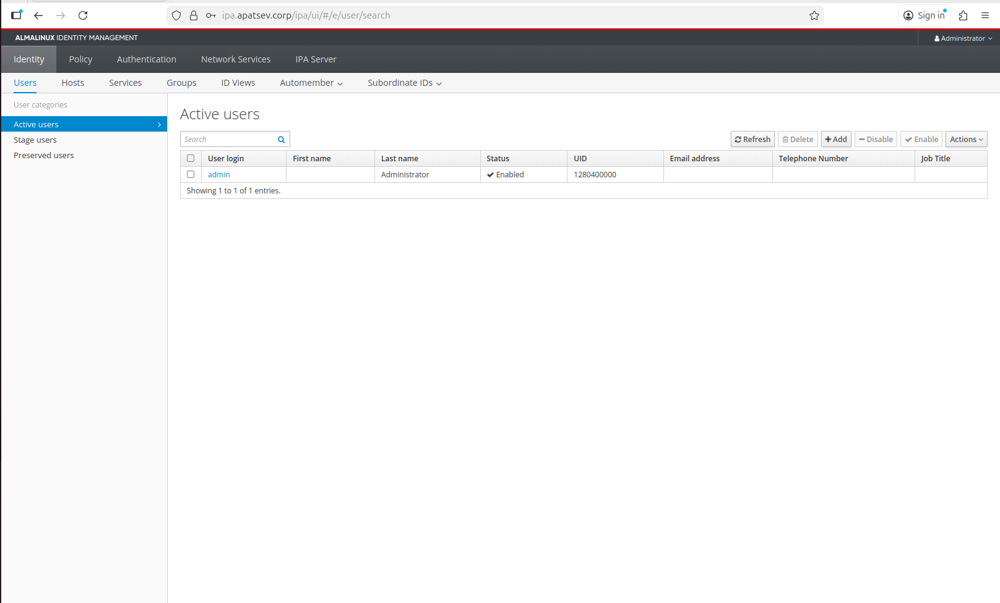

## **Установка и Настройка FreeIPA с внешним Root CA**

### **Цель**
Настроить сервер FreeIPA (систему управления идентификацией) с использованием собственного (внешнего) корневого сертификата вместо самоподписанного.

### О применении FreeIPA
FreeIPA (Free Identity, Policy and Audit) — это open‑source‑решение для централизованного управления идентификацией, аутентификацией и политиками доступа в Linux‑средах; оно объединяет LDAP‑каталог (389 DS), службу аутентификации Kerberos (MIT KDC), DNS‑сервер (BIND) и удостоверяющий центр (Dogtag), позволяя администрировать пользователей, группы, хосты и сервисы, настраивать политики паролей, SUDO‑правила и HBAC, а также обеспечивать доверенные соединения с другими доменами.

**Архитектура после изменений:**
```
Root CA (apatsev.corp)
 └── CA-сертификат для подсистемы FreeIPA/Dogtag (ipa.apatsev.corp) с вашим корпоративным сертификатом
```
> **Безопасность:** Корневой ключ (`rootCA.key`) используется для подписи. Для максимальной безопасности выполните этот шаг на изолированной, защищённой машине, а не на будущем сервере FreeIPA.


## **ПОДГОТОВИТЕЛЬНЫЙ ЭТАП: Создание инфраструктуры PKI**

### **Шаг 1: Создаём корневой сертификат (Root CA)**

> **ВАЖНО:** Этот шаг выполняется на **защищённой управляющей машине**, а не на сервере FreeIPA!

#### 1.1 Создаём конфигурационный файл для Root CA:

```bash
cat > provision/files/rootCA.cnf << 'EOF'
[ req ]
distinguished_name = req_distinguished_name
x509_extensions = v3_ca
prompt = no

[ req_distinguished_name ]
C = RU
ST = Omsk Oblast
L = Omsk
O = MyCompany
OU = Apatsev
CN = apatsev.corp Root CA

[ v3_ca ]
basicConstraints = critical, CA:TRUE, pathlen:1
keyUsage = critical, digitalSignature, cRLSign, keyCertSign
subjectKeyIdentifier = hash
authorityKeyIdentifier = keyid:always,issuer
EOF
```

**Что мы создали:**
- `basicConstraints = CA:TRUE` - указывает, что это CA-сертификат
- `keyUsage = keyCertSign` - разрешает подписывать другие сертификаты
- Остальные поля - ваши организационные данные

#### 1.2 Генерируем приватный ключ:
```bash
openssl genrsa -out provision/files/rootCA.key 4096
```

#### 1.3 Создаём самоподписанный корневой сертификат:
```bash
openssl req -x509 -new -key provision/files/rootCA.key \
  -sha256 -days 3650 \
  -out provision/files/rootCA.crt \
  -config provision/files/rootCA.cnf -extensions v3_ca
```

**Проверяем созданный сертификат:**
```bash
openssl x509 -in provision/files/rootCA.crt -text -noout | grep -A 1 "Basic Constraints\|Key Usage"
```
Должны увидеть:
```
X509v3 Basic Constraints: critical
            CA:TRUE
X509v3 Key Usage: critical
            Digital Signature, Certificate Sign, CRL Sign
```

### **Шаг 2: Создаём конфигурацию для сертификата FreeIPA**

#### 2.1 Создаём файл `ipa.cnf`:
```bash
cat > provision/files/ipa.cnf << 'EOF'
[ req ]
prompt = no
distinguished_name = dn
req_extensions = req_ext

[ dn ]
CN = ipa.apatsev.corp
O = MyCompany

[ req_ext ]
basicConstraints = critical, CA:TRUE
keyUsage = critical, digitalSignature, cRLSign, keyCertSign
subjectAltName = @alt_names
subjectKeyIdentifier = hash

[ alt_names ]
DNS.1 = ipa.apatsev.corp
DNS.2 = ipa
EOF
```

**Ключевые моменты:**
- `CN = ipa.apatsev.corp` - полное доменное имя сервера
- `CA:TRUE` и `keyCertSign` - ОБЯЗАТЕЛЬНЫ для работы FreeIPA!
- `subjectAltName` - альтернативные DNS-имена сервера

## **НАСТРОЙКА ANSIBLE**

### **Шаг 4: Создаём inventory файл**

Создайте файл `inventory.yml`:

```bash
cat > inventory.yml << 'EOF'
all:
  children:
    ipaserver:
      hosts:
        "freeipa-instance":
          ansible_host: "158.160.100.220"
  vars:
    ansible_user:  almalinux
    ipaadmin_password: ADMPassword1
    ipadm_password: ADMPassword1
    ipaserver_no_host_dns: true
    ipaserver_ip_addresses:
      - '{{ ansible_default_ipv4.address|default(ansible_all_ipv4_addresses[0]) }}'
    ipaserver_domain: apatsev.corp
    ipaserver_realm: APATSEV.CORP
    ipaserver_hostname: ipa.apatsev.corp
    ipaserver_setup_dns: true
    ipaserver_forwarders:
      - 8.8.8.8
EOF
```

### **Шаг 5: Создаём скрипт для подписи сертификатов**

Создайте файл `external-ca.sh`:

```bash
cat > provision/files/external-ca.sh << 'EOM'
#!/bin/bash
set -euo pipefail

script_root="$(cd "$(dirname "${BASH_SOURCE[0]}")" && pwd)"
provision_dir="$(cd "${script_root}/.." && pwd)"

master="${1:-}"
domain="${2:-}"

usage() {
  cat <<EOF
Usage: $0 master-fqdn domain
EOF
}

if [ -z "$master" ]; then
  echo "ERROR: master is not set"
  usage
  exit 1
fi

if [ -z "$domain" ]; then
  echo "ERROR: domain is not set"
  usage
  exit 1
fi

if [[ "$master" != *".${domain}" ]]; then
  echo "WARNING: master (${master}) does not look like it belongs to domain ${domain}"
fi

csr_file="${provision_dir}/${master}-ipa.csr"
if [ ! -f "$csr_file" ]; then
  echo "ERROR: ${csr_file} not found"
  exit 1
fi

root_ca_key="${script_root}/rootCA.key"
root_ca_crt="${script_root}/rootCA.crt"
ipa_conf="${script_root}/ipa.cnf"

for required in "$root_ca_key" "$root_ca_crt" "$ipa_conf"; do
  if [ ! -f "$required" ]; then
    echo "ERROR: required file ${required} is missing"
    exit 1
  fi
done

signed_cert="${provision_dir}/${master}-ipa.crt"
chain_file="${provision_dir}/${master}-chain.crt"

openssl x509 -req \
  -in "$csr_file" \
  -CA "$root_ca_crt" \
  -CAkey "$root_ca_key" \
  -out "$signed_cert" \
  -days 1825 \
  -sha256 \
  -extfile "$ipa_conf" \
  -extensions req_ext

cat "$signed_cert" "$root_ca_crt" > "$chain_file"

echo "Signed ${csr_file} with ${root_ca_crt} and produced ${signed_cert} and ${chain_file}"
EOM
```

**Делаем скрипт исполняемым:**
```bash
chmod +x provision/files/external-ca.sh
```

### **Шаг 6: Создаём основной playbook**

Создайте файл `playbook.yml`:

```bash
cat > provision/playbook.yml << 'EOF'
---
- name: Playbook to configure IPA server step1
  hosts: ipaserver
  become: true
  collections:
    - freeipa.ansible_freeipa
  vars:
    ipaserver_external_ca: yes

  roles:
    - role: freeipa.ansible_freeipa.ipaserver
      state: present

  post_tasks:
    - name: Copy CSR /root/ipa.csr from node to "{{ groups.ipaserver[0] + '-ipa.csr' }}"
      ansible.builtin.fetch:
        src: /root/ipa.csr
        dest: "{{ groups.ipaserver[0] + '-ipa.csr' }}"
        flat: yes

- name: Get /root/ipa.csr, sign with our Root CA and produce chain
  hosts: localhost
  gather_facts: false
  tasks:
    - name: Run external-ca.sh
      ansible.builtin.command: >
        /bin/bash
        files/external-ca.sh
        "{{ groups.ipaserver[0] }}"
        "{{ ipaserver_domain | default(groups.ipaserver[0].split('.')[1:] | join('.')) }}"
      args:
        chdir: "{{ playbook_dir }}"

- name: Playbook to configure IPA server step2
  hosts: ipaserver
  become: true
  collections:
    - freeipa.ansible_freeipa
  vars:
    ipaserver_external_cert_files: "/root/chain.crt"

  pre_tasks:
    - name: Copy "{{ groups.ipaserver[0] + '-chain.crt' }}" to /root/chain.crt on node
      ansible.builtin.copy:
        src: "{{ groups.ipaserver[0] + '-chain.crt' }}"
        dest: /root/chain.crt
        force: yes
        mode: preserve

  roles:
    - role: freeipa.ansible_freeipa.ipaserver
      state: present
EOF
```

## **ЗАПУСК УСТАНОВКИ**

### **Шаг 7: Подготовка управляющей машины**

На машине, с которой будете запускать Ansible:

```bash
# Устанавливаем необходимые коллекции Ansible
ansible-galaxy collection install freeipa.ansible_freeipa

# Запускаем проверку подключения
ansible -i inventory.yml all -m ping
```

### **Шаг 8: Запуск установки**

```bash
ansible-playbook -i inventory.yml provision/playbook.yml
```

**Что происходит по этапам:**

1. **Этап 1:** FreeIPA устанавливается в режиме "внешний CA", генерируется CSR
2. **Этап 2:** Наш скрипт подписывает CSR корневым сертификатом
3. **Этап 3:** FreeIPA завершает установку с подписанным сертификатом

## **ПРОВЕРКА УСТАНОВКИ**

После успешного выполнения playbook:

### **Проверка 1: Статус служб**
```bash
$ sudo systemctl status ipa
● ipa.service - Identity, Policy, Audit
     Loaded: loaded (/usr/lib/systemd/system/ipa.service; enabled; preset: disabled)
     Active: active (exited) since Mon 2025-12-15 04:38:03 UTC; 19min ago
    Process: 18000 ExecStart=/usr/sbin/ipactl start (code=exited, status=0/SUCCESS)
   Main PID: 18000 (code=exited, status=0/SUCCESS)
        CPU: 1.752s

Dec 15 04:38:03 ipa.apatsev.corp ipactl[18000]: Starting Directory Service
Dec 15 04:38:03 ipa.apatsev.corp ipactl[18000]: Starting krb5kdc Service
Dec 15 04:38:03 ipa.apatsev.corp ipactl[18000]: Starting kadmin Service
Dec 15 04:38:03 ipa.apatsev.corp ipactl[18000]: Starting named Service
Dec 15 04:38:03 ipa.apatsev.corp ipactl[18000]: Starting httpd Service
Dec 15 04:38:03 ipa.apatsev.corp ipactl[18000]: Starting ipa-custodia Service
Dec 15 04:38:03 ipa.apatsev.corp ipactl[18000]: Starting pki-tomcatd Service
Dec 15 04:38:03 ipa.apatsev.corp ipactl[18000]: Starting ipa-otpd Service
Dec 15 04:38:03 ipa.apatsev.corp ipactl[18000]: Starting ipa-dnskeysyncd Service
Dec 15 04:38:03 ipa.apatsev.corp systemd[1]: Finished Identity, Policy, Audit.
```

### **Проверка 2: Веб-интерфейс**
Откройте в браузере: `https://ipa.apatsev.corp`

> **ВНИМАНИЕ:** Браузер будет ругаться на самоподписанный сертификат. 
> Импортируйте `rootCA.crt` в хранилище доверенных корневых сертификатов вашего браузера.





### **Проверка 3: Командная строка**
```bash
# Проверяем, что мы администраторы
$ kinit admin
$ ipa user-find
--------------
1 user matched
--------------
  User login: admin
  Last name: Administrator
  Home directory: /home/admin
  Login shell: /bin/bash
  Principal name: admin@APATSEV.CORP
  Principal alias: admin@APATSEV.CORP, root@APATSEV.CORP
  UID: 1280400000
  GID: 1280400000
  Account disabled: False
----------------------------
Number of entries returned 1
----------------------------

```

### **Проверка 4: Сертификат**
```bash
$ openssl x509 -in /etc/ipa/ca.crt -text -noout | grep -A 1 "Issuer\|CA:TRUE"
        Issuer: C=RU, ST=Omsk Oblast, L=Omsk, O=MyCompany, OU=Apatsev, CN=apatsev.corp Root CA
        Validity
--
                CA:TRUE
            X509v3 Key Usage: critical

```

## **ТИПИЧНЫЕ ПРОБЛЕМЫ И РЕШЕНИЯ**

### **Проблема 1: "CA:TRUE not found in certificate"**
**Симптом:** Установка падает на этапе 3
**Решение:** Убедитесь, что в `ipa.cnf` есть строки:
```
basicConstraints = critical, CA:TRUE
keyUsage = critical, digitalSignature, cRLSign, keyCertSign
```

### **Проблема 2: Нет доступа к веб-интерфейсу**
**Решение:**
1. Проверьте firewall:
```bash
sudo firewall-cmd --list-all
sudo firewall-cmd --permanent --add-service={http,https,ldap,ldaps,kerberos}
sudo firewall-cmd --reload
```

### **Проблема 3: Ошибки DNS**
**Решение:** Добавьте в `/etc/hosts` на всех клиентах:
```
178.154.227.14 ipa.apatsev.corp ipa
```

## **БЕЗОПАСНОСТЬ**

### **Что делать после установки:**

1. **Защитите приватные ключи:**
```bash
# На управляющей машине
chmod 600 provision/files/rootCA.key
```

2. **Бекап и восстановление:**
```bash
# На сервере FreeIPA
$ ipa-backup --data
Preparing backup on ipa.apatsev.corp
Local roles match globally used roles, proceeding.
Stopping Directory Server
Backing up ipaca in APATSEV-CORP to LDIF
Backing up userRoot in APATSEV-CORP to LDIF
Backing up APATSEV-CORP
Starting Directory Server
Backed up to /var/lib/ipa/backup/ipa-data-2025-12-15-04-54-52
The ipa-backup command was successful
```

```bash
$ ipa-restore /var/lib/ipa/backup/ipa-data-2025-12-15-04-54-52
Directory Manager (existing master) password: 

Preparing restore from /var/lib/ipa/backup/ipa-data-2025-12-15-04-54-52 on ipa.apatsev.corp
Performing DATA restore from DATA backup
Temporary setting umask to 022
Restoring data will overwrite existing live data. Continue to restore? [no]: yes
Each master will individually need to be re-initialized or
re-created from this one. The replication agreements on
masters running IPA 3.1 or earlier will need to be manually
re-enabled. See the man page for details.
Disabling all replication.
Stopping Directory Server
Restoring from userRoot in APATSEV-CORP
Restoring from ipaca in APATSEV-CORP
Starting Directory Server
Restoring umask to 18
The ipa-restore command was successful
```

3. **Настройте брандмауэр:**
```bash
sudo firewall-cmd --permanent --remove-service=ssh
sudo firewall-cmd --reload
```

## **ЧЕК-ЛИСТ ПЕРЕД ЗАПУСКОМ**

- [ ] Hostname сервера: `ipa.apatsev.corp`
- [ ] Все файлы в `provision/files/`:
  - [ ] `rootCA.key`
  - [ ] `rootCA.crt` 
  - [ ] `ipa.cnf`
  - [ ] `external-ca.sh` (исполняемый)
- [ ] В `inventory.yml` правильные IP и пароли
- [ ] На управляющей машине установлен Ansible и коллекции
- [ ] Есть SSH доступ к серверу
- [ ] DNS записи или /etc/hosts настроены
